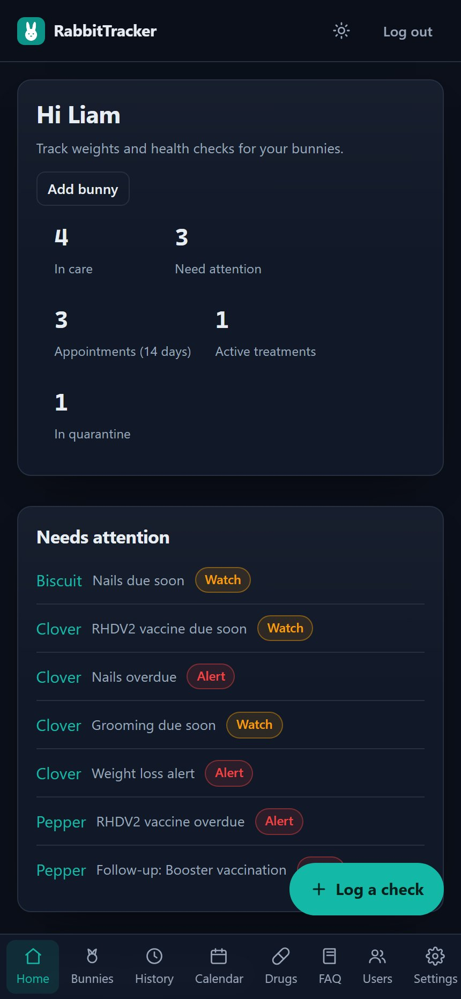
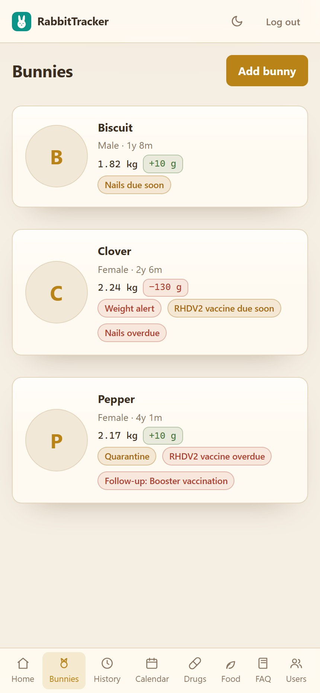
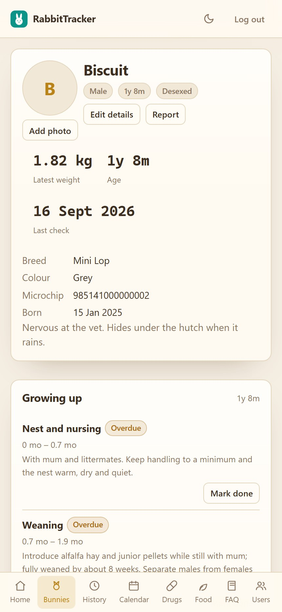
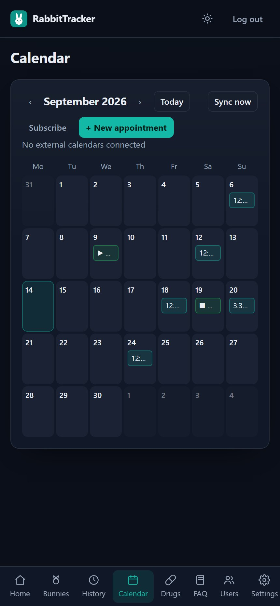
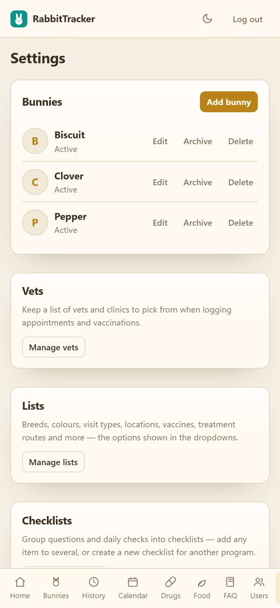
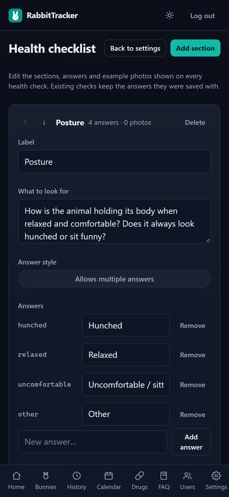
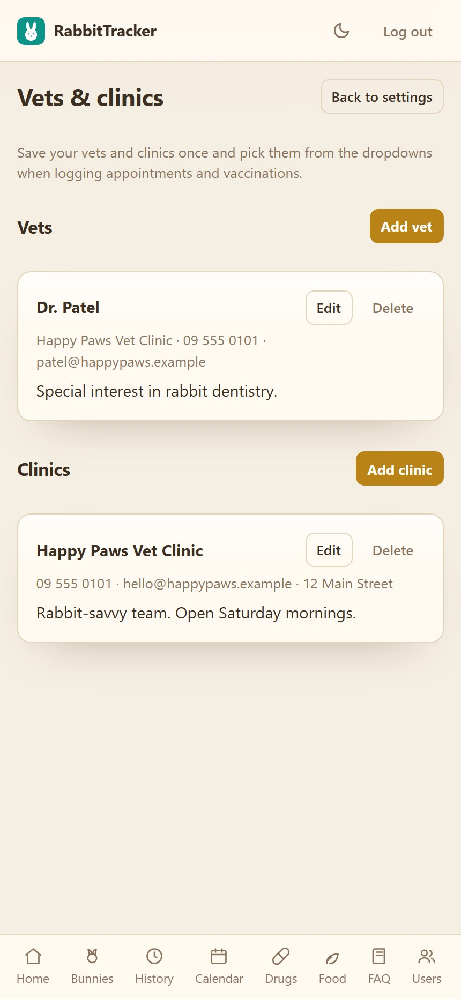
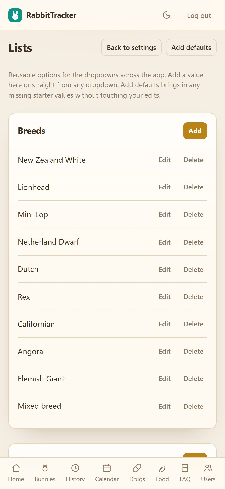
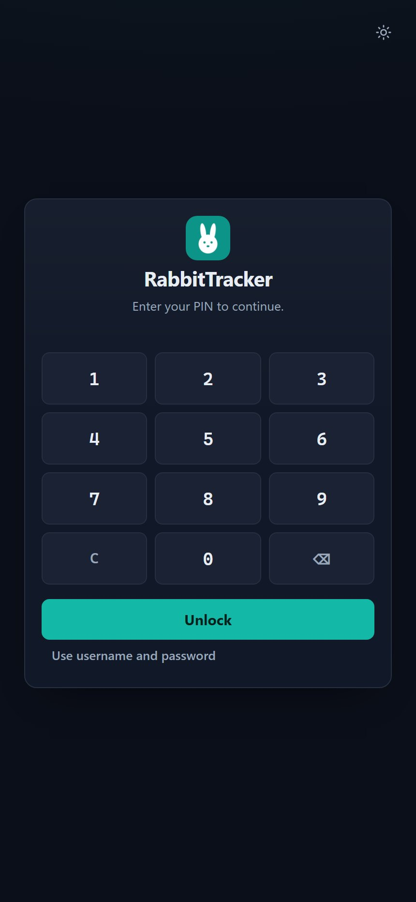
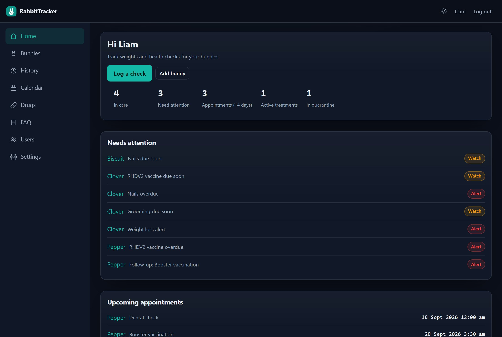

# RabbitTracker

Self-hosted web app for a household or small rescue to track the health of their rabbits. Phone-first
for quick logging, laptop-friendly for reviewing history. Admins see and control everything, while
workers (foster carers) only see the bunnies assigned to them.

Built with Express 5 + Postgres 16 + Drizzle on the server and a dependency-free vanilla TypeScript
SPA on the client. Ships as a two-container Docker Compose stack with persistent volumes.

| Home | Bunnies | Bunny profile |
| --- | --- | --- |
|  |  |  |

| Calendar | Settings | Health checklist editor |
| --- | --- | --- |
|  |  |  |

| Vets & clinics | Lists | Sign in |
| --- | --- | --- |
|  |  |  |

Desktop:



## Features

**Bunnies**
- Profiles with name, sex, breed, colour, date of birth, desexed, microchip, avatar, notes, status
  (active / deceased) and memorial details (date and reason).
- Quarantine flag with a release date, target weight range and a feeding plan.
- Bonded-bunny links (symmetric) shown on each profile.
- Photo gallery per bunny, combining check photos and journal photos.
- A flat, grouped profile — Observations, Daily routine, Health checks, Treatments & medication,
  Notes & photos, Appointments and Bunny details — with every card visible.

**Health**
- Health checks with weight, appetite, droppings, energy, body condition (1–5), temperature,
  pain score (0–10), vet notes and a photo.
- The RRR weekly health checklist (posture, demeanour, eyes, breathing, coat & skin, behaviour,
  bum, ears, nails, genitals, hocks) with tick-button answers, per-section notes and example
  photos. The checklist itself is editable in Settings. The full check form can also switch on any
  of your daily check types (Poo, Behaviour, …) so the Sunday check captures them too.
- Quick log — tick any checklist item from the bunny page and save it as a health check without
  the full form.
- **Daily checks** — define your own types in Settings (Poo, Behaviour, …) with option buttons
  (single or multi-select), a number with a unit and free text, plus photos on any log. A one-tap
  bar on the bunny profile logs a type in seconds. An **Add defaults** button in the editor pulls in
  any missing starter types (including multi-select Behaviour) on upgraded installs.
- **Food & water bowl tracking** — set a starting weight for a bowl, then log scale readings as you
  go: consumption is calculated since the last reading and the baseline rolls forward. Top up by
  entering the amount added or the bowl's new total — optionally recording the weigh-in first so
  the consumption is counted — and refresh starts a new period with an optional final weight. One
  daily consumption chart at the top of the card overlays every bowl with its day-by-day average,
  readings can be edited or deleted, and bowls can be scheduled with times of day: the calendar
  shows a chip per bowl per time and tapping it logs a weigh-in or top-up for that slot. Record the
  bowl's empty weight to see how much is actually in it, link a food product so top-ups draw from
  its stock, and enter consumption directly for greens and treats (the new weight is calculated).
- **Food & supplies** — a catalog for hay, pellets, greens and treats with a running stock total
  (add or remove amounts), a low-stock level and a type list. Link a product to a bowl and every
  top-up draws the amount added from its stock; editing or deleting the top-up puts it back.
- **Daily routine tasks** — repeating chores per bunny with morning, afternoon, evening or anytime
  slots and an every-N-days repeat. Tick them off from the bunny page or the home Today list.
- **Treatments & medication** — courses with dose, route and frequency plus the times of day each
  dose is given, each with a window (early morning 05:00–08:00, morning 08:00–12:00, afternoon
  12:00–17:00, evening 17:00–21:00, night 21:00–05:00). Logging preselects the slot for the current
  time, and doses logged outside the window are flagged **Early** or **Late** so mistakes stand
  out. The calendar shows the doses due each day with ticks per time; tap a treatment to see what
  is logged, log another dose or pick a different time for that day (tick **Change going forward**
  to add it to the schedule). Multiple
  doses can be logged per day, linked doses are grouped under the treatment on the bunny page,
  one-off doses stay in the medication log, and either can be edited later. Logged doses deduct from
  drug stock earliest-expiry-first; editing or deleting a log reconciles it. Overriding the amount
  when logging can update the treatment's dose from that day on. A dose you skipped can be logged
  as **Missed** (no stock is deducted, the slot shows a red cross), and a course **auto-completes**
  once its end date has passed and the last scheduled dose has been recorded or marked missed.
  Pop-out forms warn before closing with unsaved changes.
- **Growth norms** — starter adult weight ranges per breed (editable in Settings) scaled by age,
  plus expected daily food and water per kilogram. The weight card and the Food & water card flag
  when a bunny drifts into a watch or alert range.
- **Growing up** — age-based care stages (weaning, diet transitions, desexing windows, adult and
  senior care) computed from the bunny's date of birth, with tick-off, dates and notes. The stage
  list is editable in Settings, and the report includes the completed stages.
- Manual weigh-ins with a one-tap "Log weight" action.
- Weight trend chart with loss alerts and target-range checks.
- Timestamped notes & photos journal per bunny.
- **Printable bunny report** — pick a period (day, week, month, all time or custom dates) and save
  a light-themed PDF of the full record: profile, weights, health checks, daily checks, bowl
  tracking, routine tasks, medication doses, treatments, vaccinations, routine care, appointments
  and journal notes, with optional photos.

**Care & treatment**
- Treatments with dose, route, frequency, reason, dates and status, plus a drug cabinet with stock
  batches, expiry, reorder levels and automatic FEFO stock deduction. An **Add defaults** button
  pulls in any missing starter drugs (Doxy 100 paste, Trimethoprim Sulfa/Deprim, …) on upgraded
  installs.
- Vaccinations with next-due tracking (default booster intervals from the vaccine-type list).
- Routine care schedules (nails, teeth, grooming, or your own care types) with dated records and
  due/overdue badges.
- Vet appointments with status, cost, follow-up date and optional ICS/webcal calendar sync.
- **Calendar events** — add your own events (hay collection, volunteer runs, fundraisers, cleaning)
  with a type list, all-day option, location, optional bunny link and simple repeating schedules
  (daily, weekly, monthly). The calendar also shows logged daily checks and active medication
  courses.
- Vets and clinics directory, with inline "add new" popups in the appointment and vaccination
  forms so you never leave the form.
- Managed lists for breeds, colours, visit types, locations, vaccine types, treatment
  routes/frequencies/reasons, care types, FAQ categories and suppliers. An **Add defaults**
  button pulls in any missing starter values (dropdowns match labels case-insensitively).

**Household & admin**
- Admins sign in with username and password; workers sign in with a personal PIN and only see the
  bunnies assigned to them.
- Per-worker permissions (record health data, edit profiles, add their own bunnies, view costs,
  manage calendars, edit the FAQ).
- Admin-only user management, checklist editor, vet/clinic directory and list editor.
- Home dashboard stats: in care, needing attention, appointments (14 days), active treatments and
  quarantine.
- Export health checks CSV, appointments CSV, a JSON backup and a full ZIP backup that adds every
  photo file.
- **Share links** — a read-only live report URL per bunny (`#/share/<token>/<id>`) that
  auto-refreshes every minute. Viewers need no login, costs are hidden, and regenerating the token
  in Settings revokes every link at once.
- Demo mode — a Settings switch that loads sample bunnies, records, appointments (dated around the
  current month), journal entries, bonds, a vet and a clinic, and removes every demo row when
  switched off.
- Installable PWA with light and dark themes (light is the default).

## Quick start (Docker)

Requires [Docker Desktop](https://www.docker.com/products/docker-desktop/) (or Docker Engine with
the Compose plugin). No other dependencies.

```sh
git clone https://github.com/<your-account>/rabbittracker.git
cd rabbittracker
cp .env.example .env      # optional — sensible defaults are built in
docker compose up -d --build
```

Open <http://localhost:8091>. On first run the app asks you to create the first admin account
(username + password). Add workers from **Users**; each worker gets a unique 4–8 digit PIN.

The stack is two containers:

- `db` — Postgres 16, data in the `rt_db` volume, bound to `127.0.0.1:5434` on the host.
- `app` — the Node server (migrations run on boot), photos in the `rt_data` volume, published on
  `APP_PORT` (default `8091`). It has a healthcheck against `/api/health`.

To update after pulling changes:

```sh
docker compose up -d --build
```

To stop, or to wipe everything (including data):

```sh
docker compose down          # stop, keep volumes
docker compose down -v       # stop and DELETE the database and photos
```

Logs and status:

```sh
docker compose ps
docker compose logs -f app
```

### Deploy with Portainer

Two options:

**Prebuilt image (recommended).** Every push to `main` publishes
`ghcr.io/smartcile/rabbittracker:latest` for `linux/amd64` and `linux/arm64` via GitHub Actions.
In Portainer go to **Stacks → Add stack → Web editor**, paste
[`compose.portainer.yaml`](compose.portainer.yaml) and deploy. Everything uses
`${VAR:-default}` interpolation, so override `APP_PORT`, `POSTGRES_PASSWORD`, `COOKIE_SECURE` and
friends in the stack's **Environment variables** section, or edit the defaults in place. If the
image package is private, make it public under GitHub → Packages → rabbittracker → Package
settings, or add a `ghcr.io` registry credential in Portainer (your GitHub username plus a classic
PAT with the `read:packages` scope).

**Build from Git.** Portainer can also build the repo itself: **Stacks → Add stack → Repository**,
point it at this repository, set the compose path to `compose.yaml`, and paste any variables from
`.env.example` into the stack's environment variables. Portainer builds the image on the host.

Either way the database and photo volumes (`rt_db`, `rt_data`) are named Docker volumes, so the
stack survives container recreation.

### Environment variables

Copy `.env.example` to `.env` to override any of these (all optional):

| Variable | Default | Purpose |
| --- | --- | --- |
| `APP_PORT` | `8091` | Host port the app is published on (the container always listens on 8091). |
| `DB_PORT` | `5434` | Host port for the bundled Postgres (local development; the Portainer stack does not publish it). |
| `POSTGRES_USER` / `POSTGRES_PASSWORD` / `POSTGRES_DB` | `rabbittracker` | Database credentials for the bundled Postgres. |
| `COOKIE_SECURE` | `false` | Set to `true` only when serving over HTTPS, otherwise login breaks on plain HTTP. |
| `SESSION_IDLE_MINUTES` | `30` | Idle lock and server-side idle session expiry. |
| `SESSION_TTL_MINUTES` | `10080` | Absolute session lifetime (7 days). |
| `DATA_DIR` | `/data` in Docker, `./data` locally | Where uploaded photos are stored. |
| `DATABASE_URL` | built from the Postgres variables | Override to point at an external Postgres. |

For phone access from outside the LAN, put the machine on [Tailscale](https://tailscale.com) and
open `http://<machine-name>:8091` from the phone. To share a bunny's live report with someone
outside your network, expose the app through a Cloudflare tunnel and send the share link from that
bunny's report page — viewers see only the report screen, never the app.

## Sign-in and roles

- **Admins** sign in with username and password and see every bunny. They manage users, lists, the
  checklist, vets/clinics and exports. An admin can set a personal PIN in **Settings → Account**
  for quick sign-in on a shared device.
- **Workers** sign in with a personal 4–8 digit PIN and only see bunnies assigned to them (assign
  carers from a bunny's page). Their permissions are ticked per worker in **Users**: record health
  data, edit bunny profiles, add their own bunnies, view costs, manage calendar sync, edit the FAQ.
  A worker with "add their own bunnies" is assigned automatically when they create one.

## Demo data

**Settings → Demo data** loads a full sample dataset: three bunnies with weight history, checklist
answers, temperatures and pain scores, treatments with logged medication doses, recent daily check
logs (single- and multi-select, numbers and notes), bowl readings, routine tasks with completions,
vaccinations, care schedules, appointments placed around the current month, journal entries, bonded
pairs, plus a clinic and a vet. Switch it off to delete every demo row — your own data is untouched.
Handy for trying the app or taking screenshots.

## Local development

```sh
docker compose up -d db     # Postgres only, on host port 5434
npm install
npm run dev                 # server on 8091 + Vite client on 5174
```

- Client dev server: <http://localhost:5174> (proxies `/api` to `8091`).
- API/server: <http://localhost:8091> (migrations run on boot).
- Data dir for photos defaults to `./data` locally.

Commands:

| Command | Purpose |
| --- | --- |
| `npm run dev` | Server + Vite client with watch mode. |
| `npm run typecheck` | `tsc` for server and client. |
| `npm run test` | Vitest unit suites (pure logic, validation, mappers). |
| `npm run build` | Typecheck + client production build. |
| `npm run db:generate` | Generate a SQL migration from schema changes. |

On Windows PowerShell use `npm.cmd` (the `npm.ps1` shim is blocked by default).

## Data and backups

- Postgres data lives in the `rt_db` volume; photos live in the `rt_data` volume. Back up volumes,
  not containers — or use **Settings → Export → Full backup (ZIP)** for a portable archive of every
  table plus every photo file (session tokens and password/PIN hashes are excluded).
- Weight is stored as integer grams and money as integer cents; temperatures as tenths of a degree.
  No floats in the database.
- Migrations are committed under `server/drizzle/` and applied automatically at boot.

## Project layout

```
client/    Vite SPA — pages, components, design system (no runtime dependencies)
server/    Express API — routes, Drizzle schema, services, seeds, migrations
shared/    Types and pure logic shared by both (health math, checklists, drug dosing)
docs/      Screenshots used in this README
```
